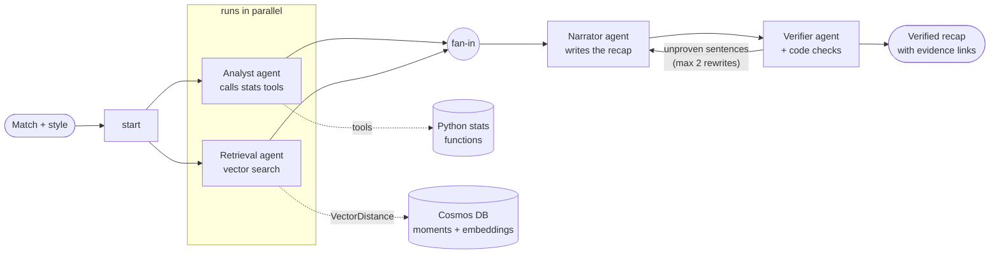

# Inside the Game

**Football match recaps where every sentence shows its proof.**

Four AI agents turn the raw event data of a (synthetic) football match into a readable recap, in a fan,
analyst or broadcaster voice. Every sentence links to the evidence behind it: click it and you see the
events on a pitch, the statistics, or similar moments from other matches. A Verifier agent fact-checks
each sentence against that evidence and sends anything unproven back for a rewrite.

**Live demo:** https://gentle-mushroom-01796580f.4.azurestaticapps.net

Built for the Microsoft x Premier League Developer Hackathon with the
[Microsoft Agent Framework](https://github.com/microsoft/agent-framework), Microsoft Foundry and Azure.

> All teams, players and matches are **synthetic**. No real Premier League data, names or logos are used.

---

## How it works



The four agents run as one **Agent Framework workflow** ([workflow.py](inside_the_game/workflow.py)):

| Agent | Job | How it stays honest |
|---|---|---|
| **Analyst** | Finds what mattered: result, goals, lead changes, counterattacks, shots, possession | It never does arithmetic. It calls deterministic Python **tools** ([stats.py](inside_the_game/stats.py)) and cites the tool and `event_ids` behind each finding. Code rejects event ids that don't exist. |
| **Retrieval** | Compares this match's key moments with similar ones in other matches | Code describes each goal and counterattack in plain text, embeds it with `text-embedding-3-small`, and searches Cosmos DB with vector search. The agent cites moment ids; code rejects any id a search didn't return. |
| **Narrator** | Writes the recap in the chosen style | It only sees numbered findings, never event ids. Each sentence cites finding numbers, and **code** resolves them to the real evidence, so links can't be invented. |
| **Verifier** | Fact-checks every sentence | It sees only that sentence's own evidence (tool results, events, similar moments) and reasons before its verdict. Code checks add rules an LLM shouldn't be trusted with: no leaked internals, no overlong sentences, comparisons must name a real match. |

### Design principles

- **Numbers come from code, words come from AI.** Statistics are computed by tested Python functions; the
  models only choose and phrase them.
- **Evidence is attached by code, not by the model.** Agents cite ids, and code looks up the evidence, so every
  link in the UI points at real data.
- **Fail closed.** A sentence still unproven after two rewrites is removed (and logged); a failed headline falls
  back to the plain scoreline. If retrieval fails, the recap is still produced, just without comparisons.
- **Show the work.** The UI shows the agents running live, the evidence behind each sentence, and a fact-check
  log of everything the Verifier sent back.

## Azure services

| Service | Used for |
|---|---|
| **Microsoft Foundry** | `gpt-5.4-mini` for all four agents, `text-embedding-3-small` for moment embeddings |
| **Azure Cosmos DB** (NoSQL) | Matches, verified recaps, and moment embeddings with a vector index (`quantizedFlat`, cosine) |
| **Azure Container Apps** | The FastAPI backend, scaling to zero when idle |
| **Azure Static Web Apps** | The React UI, deployed by GitHub Actions |
| **Azure Container Registry** | The backend image |
| **Application Insights** | OpenTelemetry traces of every run: agents, tool calls, model calls with token counts, Cosmos calls |

No keys or secrets anywhere: the backend authenticates with a **managed identity** (Entra ID) to Cosmos DB
(key access disabled) and Foundry. Locally, the same code uses your `az login`.

## Run it locally

Prerequisites: Python 3.11, Node 20.19+, the Azure CLI (`az login`), a Microsoft Foundry project with
`gpt-5.4-mini` and `text-embedding-3-small` deployed, and a Cosmos DB account with vector search enabled
(database `insidethegame`; containers `matches`, `recaps` and `moments`, all partitioned by `/match_id`, with a
1536-dimension vector index on `/embedding` in `moments`).

```bash
python -m venv .venv && source .venv/bin/activate
pip install -e ".[dev]"
cp .env.example .env               # fill in your Foundry and Cosmos endpoints

python -m inside_the_game.moments --count 30        # generate 30 matches, embed their key moments
python -m inside_the_game.workflow --seed 5 --style fan   # run the agents on one match in the terminal

uvicorn inside_the_game.api:app --port 8000          # the API
cd frontend && npm install && npm run dev            # the UI on http://localhost:5173
```

Other useful commands:

| Command | What it does |
|---|---|
| `python -m inside_the_game.generator --count 5` | Write synthetic matches to `data/matches/` |
| `python -m inside_the_game.pregenerate --count 5` | Pre-generate recaps for the demo (add `--redo-removed` to retry ones that lost sentences) |
| `python -m inside_the_game.workflow --diagram` | Print the workflow graph as Mermaid |
| `TRACING=1 python -m inside_the_game.workflow ...` | Send traces to Application Insights from your machine |
| `pytest` | 74 tests; no Azure or model calls needed |

## The data

[generator.py](inside_the_game/generator.py) simulates a match possession by possession from a seed, so the same
seed always gives the same match: about 1,200 events, 2.9 goals and 28 shots per match on average, with fast-break
counterattacks. Each event looks like this:

```json
{"event_id": 1042, "minute": 63, "team": "Home", "player": "H9", "type": "shot",
 "x": 88, "y": 41, "outcome": "goal", "possession_id": 211}
```

`x` and `y` run from 0 to 100, with `x` measured from the acting team's own goal toward the goal it attacks.

## API

| Endpoint | |
|---|---|
| `GET /api/matches` | Match summaries |
| `GET /api/matches/{id}` | A match with all its events |
| `GET /api/matches/{id}/stats` | The tool results the agents saw |
| `GET /api/matches/{id}/recaps/{style}` | A saved verified recap |
| `POST /api/matches/{id}/recaps/{style}` | Run the agents, streaming progress as Server-Sent Events, then save |

Generating a recap calls the models, so on the public deployment it requires a demo passcode
(`X-Recap-Passcode`, stored as a Container Apps secret). Everything else is open.

## Project layout

```
inside_the_game/
  generator.py   synthetic matches          stats.py      deterministic stats tools
  analyst.py     Analyst agent + tools      moments.py    key moments + descriptions
  retrieval.py   Retrieval agent            narrator.py   Narrator agent + evidence resolution
  verifier.py    Verifier agent + checks    workflow.py   the Agent Framework workflow
  store.py       Cosmos DB access           api.py        FastAPI backend
  foundry.py     Foundry clients, auth      tracing.py    Azure Monitor tracing
  pregenerate.py demo recap generation
frontend/        React + TypeScript UI (Vite)
tests/           pytest suite (fakes for agents, no network)
.github/         CI (tests, build, lint) and the frontend deployment
```
